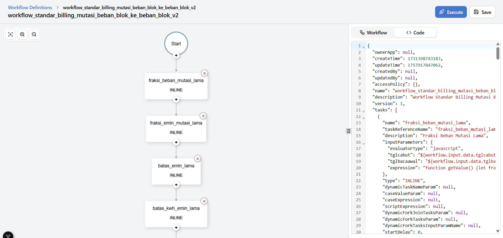

# Iconplus PLN take home test



This web automatically fetches to http://localhost:8080/api/metadata/workflow/workflowstandar*billing_mutasi_beban_blok_ke_beban_blok_v2*. Make sure to read the documentation at https://github.com/sonywibisono/conductor-compose and use http://localhost:8080 to open API docs.

Note: don't forget turn on your **CORS extention**

## 📦 Tech Stack

- **Vue.js**
- **Typescript**
- **Vite**

## 🧑‍💻 How to Clone and Run

### 1. Clone the Repository

```
git clone git@github.com:hendrialqori/iconplus-pln.git

cd iconplus-pln
```

### 2. Run the Frontend Client)

```
npm install

npm run dev
```

🌐 Visit the app at: http://localhost:5173

## License

Feel free to use for personal.
